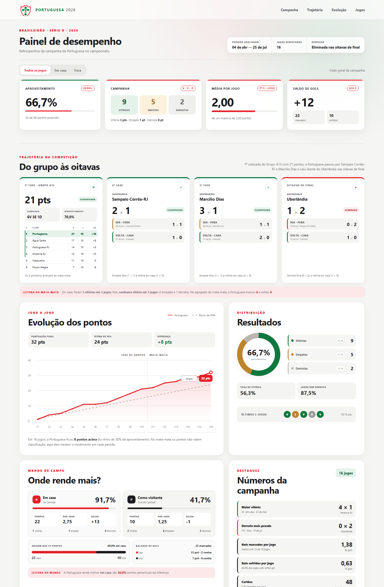

  

<h1 align="center">Dashboard Gerencial — Portuguesa na Série D 2026</h1>

  Projeto de análise de dados esportivos que transforma os resultados da campanha da Portuguesa em indicadores de desempenho, leitura por fase e retrospectiva do mata-mata.

  
  
  
  

## Sobre o projeto

Esta dashboard apresenta uma retrospectiva da campanha da Associação Portuguesa de Desportos na Série D do Campeonato Brasileiro de 2026 sob uma perspectiva gerencial. O painel consolida os resultados jogo a jogo, compara o desempenho dentro e fora de casa e mostra a trajetória do clube da fase de grupos até a eliminação no mata-mata.

## Panorama analisado

| Indicador | Resultado |
|---|---:|
| Jogos disputados | 16 |
| Pontos conquistados | 32 |
| Campanha | 9 vitórias, 5 empates e 2 derrotas |
| Aproveitamento | 66,7% |
| Média de pontos | 2,00 por jogo |
| Gols | 22 marcados e 10 sofridos |
| Saldo de gols | +12 |
| Desfecho | Eliminada nas oitavas de final |

Os dados cobrem a campanha completa, de 4 de abril a 25 de julho de 2026.

## Trajetória

| Fase | Adversário | Ida | Volta | Agregado | Situação |
|---|---|:---:|:---:|:---:|---|
| 1ª fase — Grupo A13 | — | — | — | 21 pts | 1ª colocada |
| 2ª fase | Sampaio Corrêa-RJ | 1 × 1 (fora) | 1 × 0 (casa) | 2 × 1 | Classificada |
| 3ª fase | Marcílio Dias | 1 × 1 (fora) | 2 × 0 (casa) | 3 × 1 | Classificada |
| Oitavas de final | Uberlândia | 0 × 2 (fora) | 1 × 0 (casa) | 1 × 2 | Eliminada |

## Principais insights

- A Portuguesa liderou o Grupo A13 com **21 pontos** (6V 3E 1D) e **70,0% de aproveitamento**.
- O Canindé foi decisivo: **91,7% de aproveitamento em casa** (7V 1E, 22 dos 32 pontos), contra **41,7% como visitante**.
- No mata-mata, a equipe **venceu os 3 jogos em casa** e **não venceu nenhum dos 3 fora**; a derrota por 2 × 0 em Uberlândia definiu a eliminação.
- **Cadorini foi o artilheiro, com 8 gols** (5 na fase de grupos e 3 no mata-mata), dois deles decisivos para vitórias.
- Marcar primeiro foi determinante: o time **abriu o placar em 10 jogos e somou 26 dos 30 pontos** possíveis neles.
- A faixa mais produtiva foi **dos 61 aos 75 minutos** (6 gols), e o time ganhou **6 pontos** em relação aos placares de intervalo.
- **28 atletas** foram utilizados; o goleiro Bruno Bertinato esteve em campo em **93,8% dos minutos**.
- Na classificação geral da Série D, a Portuguesa ficou em **10º entre 96 clubes**, com o **melhor aproveitamento em casa** de toda a competição (91,7%).
- Em relação a 2025 (eliminação na 2ª fase, nos pênaltis), o time **foi mais longe**, com aproveitamento semelhante (**66,7%** contra 68,8%).

## O que a dashboard entrega

O painel é dividido em páginas, acessíveis pelo menu superior (cada uma tem seu próprio endereço, como <code>#gols</code>):

| Página | Conteúdo |
|---|---|
| **Início** | Resumo: aproveitamento, campanha, gols, artilheiro, trajetória em etapas, destaques, últimos jogos e atalhos para as análises |
| **Trajetória** | Classificação do grupo, confrontos de ida e volta do mata-mata e retrospecto por adversário |
| **Desempenho** | Indicadores, evolução dos pontos (com tooltip de cada jogo), resultados, mando de campo e consistência |
| **Gols** | Artilharia (gols por fase, pênaltis, faltas e decisivos), gols por faixa de 15 minutos e antes e depois do intervalo |
| **Elenco** | Atletas utilizados, time-base, titularidades, minutos estimados, banco de reservas, disciplina e download em CSV |
| **Jogos** | Tabela completa com busca por adversário ou atleta, detalhes de cada partida (gols, escalação, árbitro, público, links da súmula e do boletim), arbitragem e download em CSV |
| **Série D** | Indicadores comparados à média dos 96 clubes, ranking em cada um e classificação geral completa |
| **Público e viagens** | Público e renda por jogo (boletins financeiros) e mapa das viagens com a quilometragem da campanha |
| **2025 × 2026** | Comparação com a temporada anterior |
| **Atleta** | Página de cada jogador (aberta ao clicar no nome): foto, jogos, minutos, gols e participação jogo a jogo |

Os filtros por mando de campo (casa/fora) e por fase (grupos/mata-mata) aparecem nas páginas Desempenho, Gols, Elenco e Jogos e valem para todas elas. O painel também tem tema claro e escuro.

## Metodologia

- Vitória: 3 pontos; empate: 1 ponto; derrota: 0 ponto;
- aproveitamento: pontos conquistados ÷ pontos possíveis.

No mata-mata os pontos não definem a classificação, que depende do placar agregado (e dos pênaltis, quando há empate). Mesmo assim, o painel soma os pontos dessas partidas para medir o rendimento jogo a jogo de forma comparável entre as fases.

O painel considera somente partidas com <code>status</code> igual a <code>finished</code> e resultado identificado como <code>V</code>, <code>E</code> ou <code>D</code>. Gols, placares de intervalo, escalações e cartões vêm dos eventos das súmulas da CBF:

- gols contra são atribuídos ao adversário do autor;
- o minuto do gol é contado dentro de cada tempo, e os acréscimos entram na última faixa (45+ e 90+);
- um **gol decisivo** é aquele que colocou o time à frente de vez numa vitória; o **gol da vaga** é o que deixou o time à frente de vez no placar agregado de um confronto de mata-mata;
- a **classificação geral** ordena os clubes pela fase alcançada e, dentro dela, por pontos, vitórias, saldo e gols marcados;
- o **público** é o total de ingressos vendidos (incluindo gratuidades) informado nos boletins financeiros; boletins escaneados, sem texto, ficam sem dados;
- as **distâncias** são em linha reta entre a cidade-sede e a cidade do jogo, ida e volta;
- os **minutos jogados** são estimados a partir das substituições e expulsões, com 90 minutos por partida (sem acréscimos);
- os cartões do time incluem a comissão técnica; os cartões por atleta consideram só os jogadores.

## Tecnologias utilizadas

- **Python:** coleta e preparação dos dados (com pdfplumber para leitura dos boletins financeiros);
- **Streamlit:** publicação e disponibilização da aplicação;
- **JavaScript:** cálculos, filtros e renderização dos gráficos;
- **HTML e CSS:** estrutura, responsividade e identidade visual;
- **CSV:** armazenamento da base consolidada;
- **GitHub:** versionamento e integração com o deploy.

## Estrutura do projeto

<pre><code>analise_portuguesa/
├── app.js                      # cálculos e renderização da dashboard
├── coleta_detalhada.py         # coleta na CBF e geração dos CSVs e do dados.js
├── boletins.json               # cache do público e da renda lidos dos boletins (gerado)
├── config.json                 # clube, competição, cores e temporada de comparação
├── coordenadas.json            # cache das coordenadas das cidades (gerado)
├── dados.js                    # dados da dashboard (gerado pela coleta)
├── dashboard-preview.png
├── index.html
├── iniciar.py                  # inicia o Streamlit (com correção para Windows)
├── portuguesa-logo.svg
├── portuguesa_serie_d_2025_grupo.csv
├── portuguesa_serie_d_2025_todos_jogos.csv
├── portuguesa_serie_d_2026_atletas.csv
├── portuguesa_serie_d_2026_classificacao_geral.csv
├── portuguesa_serie_d_2026_gols.csv
├── portuguesa_serie_d_2026_grupo.csv
├── portuguesa_serie_d_2026_todos_jogos.csv
├── requirements.txt            # dependências do Streamlit
├── requirements-coleta.txt     # dependências da coleta (leitura dos PDFs)
├── requirements-dev.txt        # dependências dos testes
├── server.js
├── streamlit_app.py
├── styles.css
├── tests/test_coleta.py        # testes do tratamento das súmulas
├── tests/test_painel.py        # testes da dashboard no navegador (Playwright)
├── .github/workflows/          # testes a cada push e coleta automática semanal
└── windows_asyncio.py
</code></pre>

## Executar localmente

### Streamlit

<pre><code>git clone https://github.com/isranetoo/analise_portuguesa.git
cd analise_portuguesa
python -m pip install -r requirements.txt
python iniciar.py
</code></pre>

A aplicação será disponibilizada normalmente em <code>http://localhost:8501</code>.

O <code>iniciar.py</code> equivale a <code>python -m streamlit run streamlit_app.py</code>, mas evita no Windows o aviso inofensivo <code>ConnectionResetError [WinError 10054]</code>, que o asyncio registra quando o navegador encerra uma conexão.

### Versão HTML

<pre><code>node server.js
</code></pre>

Depois, acesse <code>http://localhost:8000</code>.

## Atualização dos dados

O arquivo <code>coleta_detalhada.py</code> busca os jogos na API pública usada pelo site da CBF, sem necessidade de chave. Ele descobre sozinho as fases da competição e gera, para a temporada principal:

- <code>…_todos_jogos.csv</code>: uma linha por partida, com fase, mando, placares final e do intervalo, pênaltis, estádio, árbitro e cartões;
- <code>…_grupo.csv</code>: classificação final do grupo na primeira fase;
- <code>…_gols.csv</code>: todos os gols das partidas, com autor, tempo, minuto e tipo (normal, pênalti, falta ou contra);
- <code>…_atletas.csv</code>: participação de cada atleta em cada partida (titularidade, minutos, gols e cartões).

Para a temporada de comparação, gera apenas os jogos e o grupo. Por fim, tudo é consolidado em <code>dados.js</code>, que é o arquivo lido pela dashboard.

<pre><code>python -m pip install -r requirements-coleta.txt
python coleta_detalhada.py
</code></pre>

A coleta é resiliente: cada consulta à CBF tem novas tentativas e, se uma rodada continuar indisponível, o coletor encerra com erro sem alterar os arquivos. Boletins financeiros e coordenadas ficam em cache (<code>boletins.json</code> e <code>coordenadas.json</code>), então uma falha de rede nunca apaga dados já obtidos.

Após atualizar os dados e enviar um novo commit para a branch <code>main</code>, o Streamlit Community Cloud realiza o redeploy da aplicação.

### Testes

<pre><code>python -m pip install -r requirements-dev.txt
python -m playwright install chromium
python -m unittest
</code></pre>

São testados o tratamento das súmulas (gol contra, pênaltis, minutos jogados, boletins, classificação) e a dashboard no navegador (páginas, filtros, página do atleta, download de CSV e funcionamento sem internet). Sem o Playwright instalado, os testes do navegador são ignorados.

### Automação no GitHub

- **Testes** (<code>.github/workflows/testes.yml</code>): rodam a cada push e pull request.
- **Coleta automática** (<code>.github/workflows/coleta.yml</code>): toda segunda-feira, de abril a novembro, executa a coleta e, se os dados mudarem, faz um commit na branch <code>main</code> (o que dispara o redeploy do Streamlit). Também pode ser executada manualmente pela aba *Actions*. Para uma nova temporada, basta atualizar o ano no <code>config.json</code>.

### Analisar outro clube ou temporada

Basta editar o <code>config.json</code>: id do clube na CBF, nome, artigo ("o" ou "a", usado nos textos), escudo, cores, competição (<code>slug</code> como <code>serie-d</code> ou <code>serie-c</code>), ano e temporada de comparação. Depois, execute a coleta novamente. Os nomes dos adversários podem ser ajustados na seção <code>nomes</code>.

## Créditos

Projeto adaptado do painel de análise do Náutico desenvolvido por [pablohmelo02](https://github.com/pablohmelo02/analise_nautico). Escudo da Portuguesa em domínio público, via [Wikimedia Commons](https://commons.wikimedia.org/wiki/File:Associa%C3%A7%C3%A3o_Portuguesa_de_Desportos.svg). Dados: [CBF](https://www.cbf.com.br/futebol-brasileiro/tabelas/campeonato-brasileiro/serie-d/2026).
